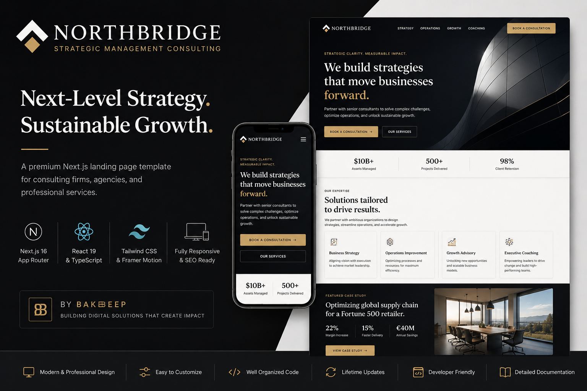
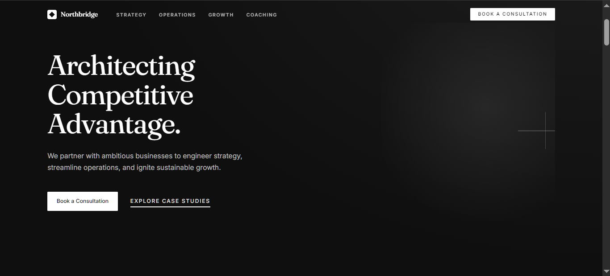
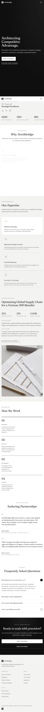
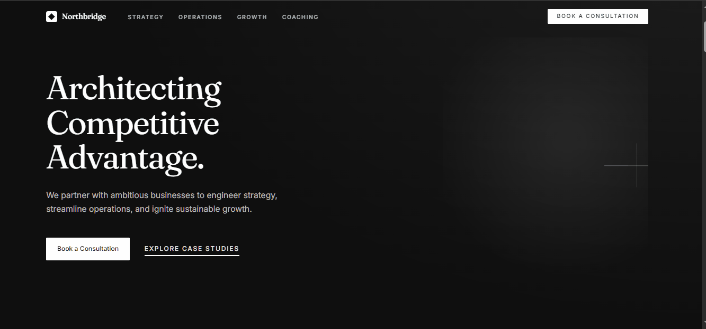

# Northbridge

> **A production-ready SaaS landing page template built with Next.js, React, TypeScript, and Tailwind CSS.**




---

## Overview

Northbridge is a premium SaaS landing page template engineered for startups, AI companies, fintech platforms, agencies, and modern technology businesses.

Built with **Next.js 16**, **React 19**, **TypeScript**, and **Tailwind CSS**, Northbridge provides a scalable foundation for launching professional marketing websites without starting from scratch.

The project emphasizes clean architecture, reusable components, responsive design, accessibility, and performance, making it suitable for production use and long-term maintenance.

---

## Live Demo

🌐 **https://northbridge-nine.vercel.app**

---

## Preview

### Desktop



### Mobile



### Product Demo



---

# Features

* Modern SaaS landing page
* Fully responsive design
* Component-based architecture
* Built with Next.js App Router
* React 19
* TypeScript support
* Tailwind CSS styling
* Framer Motion animations
* Lucide React icons
* SEO-ready metadata
* Performance-focused architecture
* Accessible user interface
* Clean and maintainable codebase
* Production-ready project structure

---

# Technology Stack

## Framework

* Next.js 16

## Frontend

* React 19
* TypeScript
* Tailwind CSS
* Framer Motion
* Lucide React
* CLSX

## Tooling

* ESLint
* PostCSS

---

# Folder Structure

```text
northbridge/
│
├── docs/
│   ├── INSTALLATION.md
│   ├── CUSTOMIZATION.md
│   ├── CHANGELOG.md
│   ├── FAQ.md
│   ├── SUPPORT.md
│   ├── DEPLOYMENT.md
│   └── TROUBLESHOOTING.md
│
├── public/
├── src/
│
├── README.md
├── LICENSE
├── package.json
└── next.config.ts
```

---

# Quick Start

## 1. Clone the repository

```bash
git clone https://github.com/bakeolam-beep/northbridge.git
```

## 2. Install dependencies

```bash
npm install
```

## 3. Start the development server

```bash
npm run dev
```

Open your browser and visit:

```text
http://localhost:3000
```

---

# Documentation

Comprehensive documentation is available in the **docs/** directory.

* Installation Guide
* Customization Guide
* Deployment Guide
* FAQ
* Troubleshooting
* Changelog
* Support Guide

---

# Customization

Northbridge has been designed to be easy to adapt to your brand.

You can customize:

* Logo
* Navigation
* Hero section
* Services
* Case studies
* Pricing
* Testimonials
* Contact information
* Footer
* Brand colors
* Typography
* Metadata
* SEO settings

Refer to:

```text
docs/CUSTOMIZATION.md
```

---

# Performance

Northbridge is built with production performance in mind.

* Optimized component architecture
* Responsive layouts
* Semantic HTML
* Modern CSS
* Reusable UI components
* SEO-friendly metadata
* Lightweight dependency footprint

---

# Browser Support

Northbridge supports the latest stable versions of:

* Google Chrome
* Microsoft Edge
* Mozilla Firefox
* Safari

---

# Support

If you need help using or customizing Northbridge, consult the documentation included in the **docs/** directory.

Support information for customers is provided with the commercial download.

---

# Changelog

Version history is maintained in:

```text
docs/CHANGELOG.md
```

---

# License

This project is licensed under the MIT License.

See the **LICENSE** file for details.

---

# About BakeBeep

BakeBeep is a software studio focused on building premium web interfaces, reusable UI systems, and production-ready templates for developers, startups, and businesses.

Northbridge is the first product in the **BakeBeep Templates** collection—a growing catalog of commercial frontend templates engineered with modern technologies and designed for real-world production use.

---

**Northbridge v1.0.0**

Built with care by **BakeBeep**.
